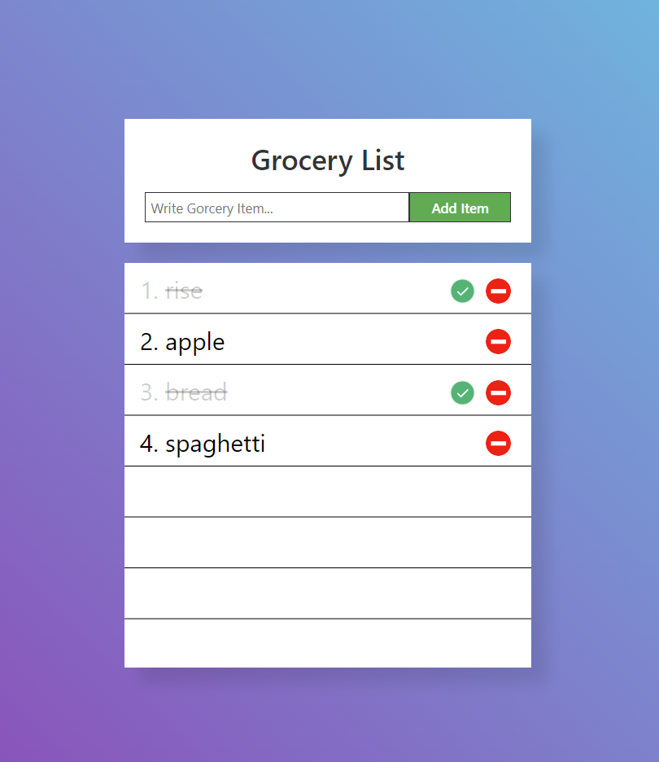

# fun-js-projects

The repository stores diiferent JavaScript projects toolked from turtorials on the www.youtube.com
Main purpose is to practice HTML, CSS and JavaScript.
Projects:
1. Simple-grocery-list
