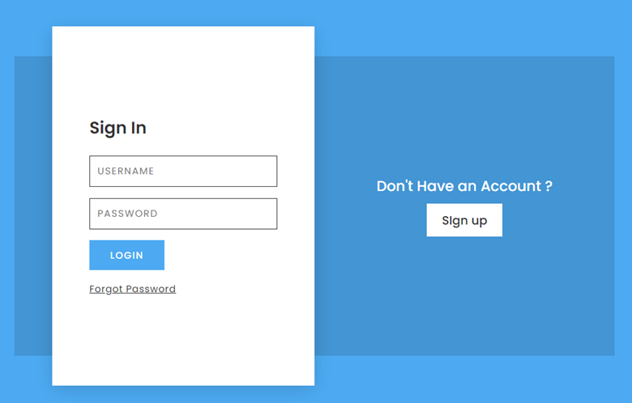
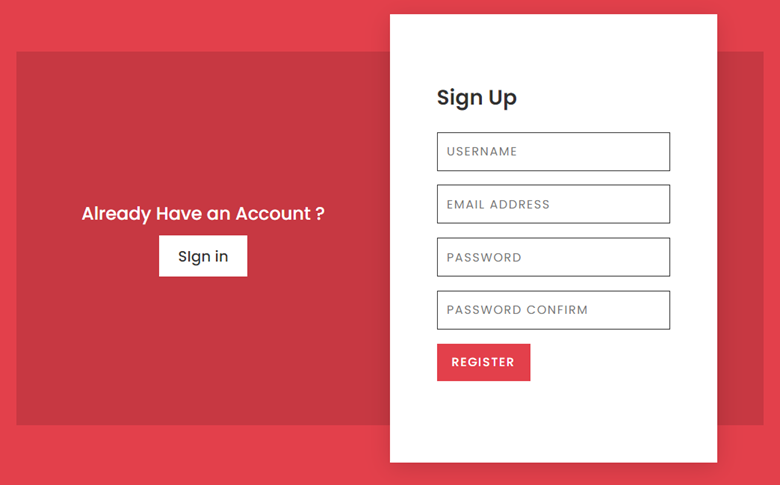

# fun-js-projects

In theis repository are stored various JavaScript projects. They were created based on the tutorials on www.youtube.com

Main goal is to practice HTML, CSS and JavaScript.

Projects:
1. Simple-grocery-list

2. Animated form

